# 📚 Library Management System

A simple **Library Management System** built with **Node.js**, **Express.js**, **MongoDB**, and **EJS** following the **MVC architecture**. The application allows librarians to manage books and members efficiently. It supports **book cover image uploads** using **Multer** and provides a responsive user interface with **Bootstrap 5**.

---

# ✨ Features

* 📚 Add, View, Edit, Delete Books
* 👥 Add, View, Edit, Delete Members
* 🔍 Search Books by Title
* 🔍 Search Members by Name
* 🖼️ Upload Book Cover Images
* 📊 Dashboard with Library Statistics
* 📱 Responsive Bootstrap 5 Interface
* 🏗️ MVC Project Structure

---

## 📸 Screenshots

> Place all screenshots inside the **`uploads/`** folder in your project root.

### Dashboard

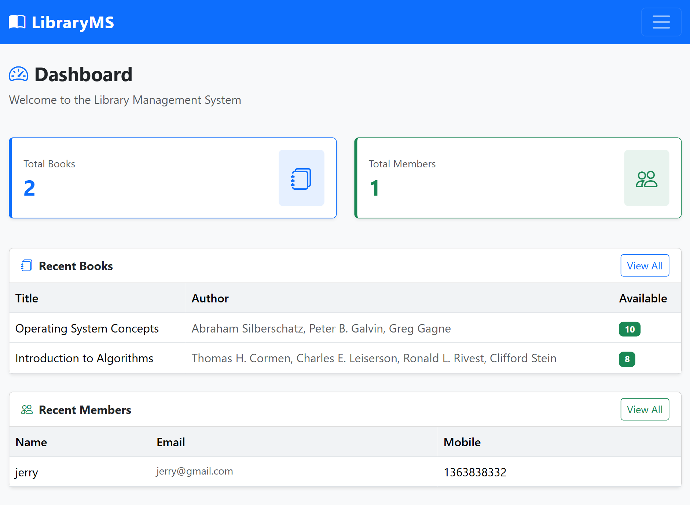

---

### Add Book

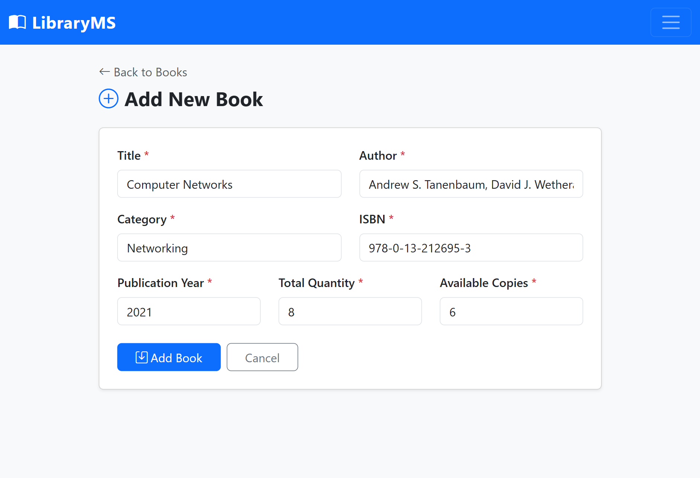

---

### Book Added Successfully

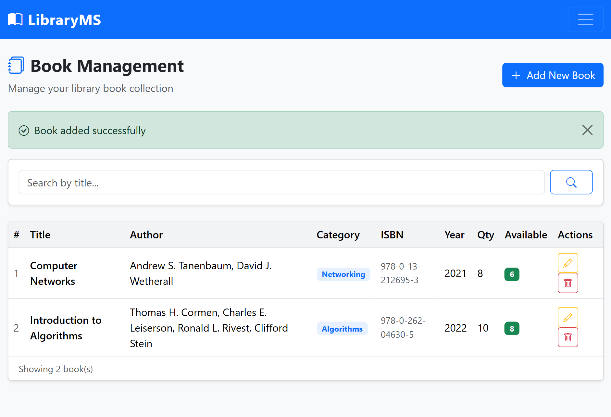

---

### View All Books

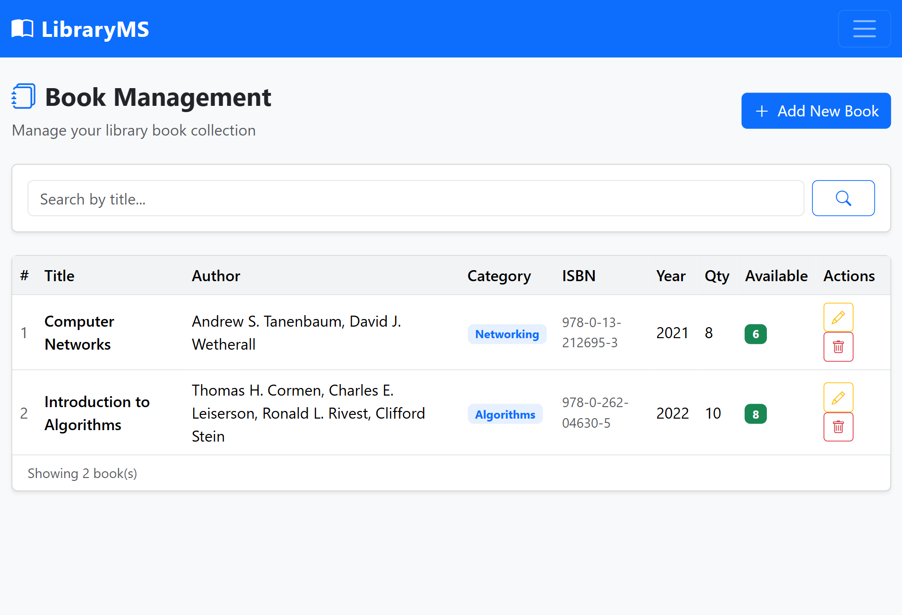

---

### Search Books

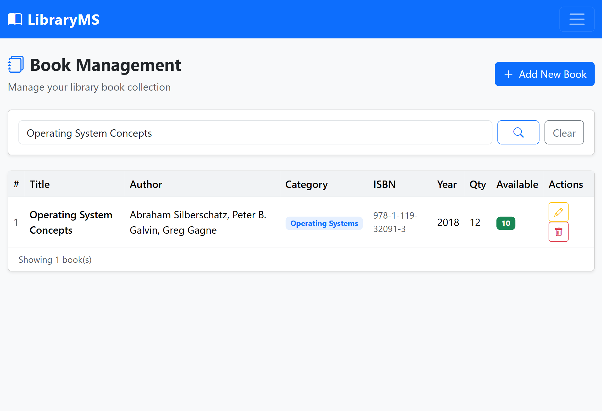

---

### Update Book

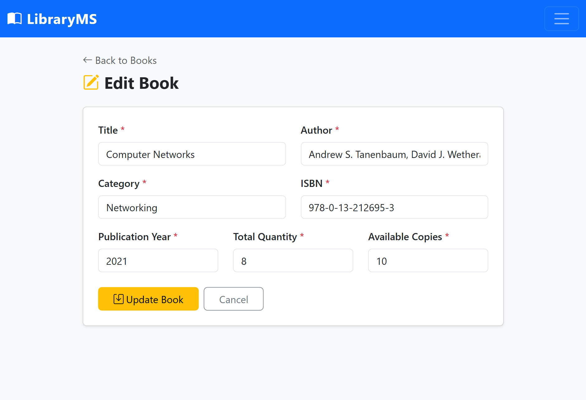

---

### Book Updated Successfully

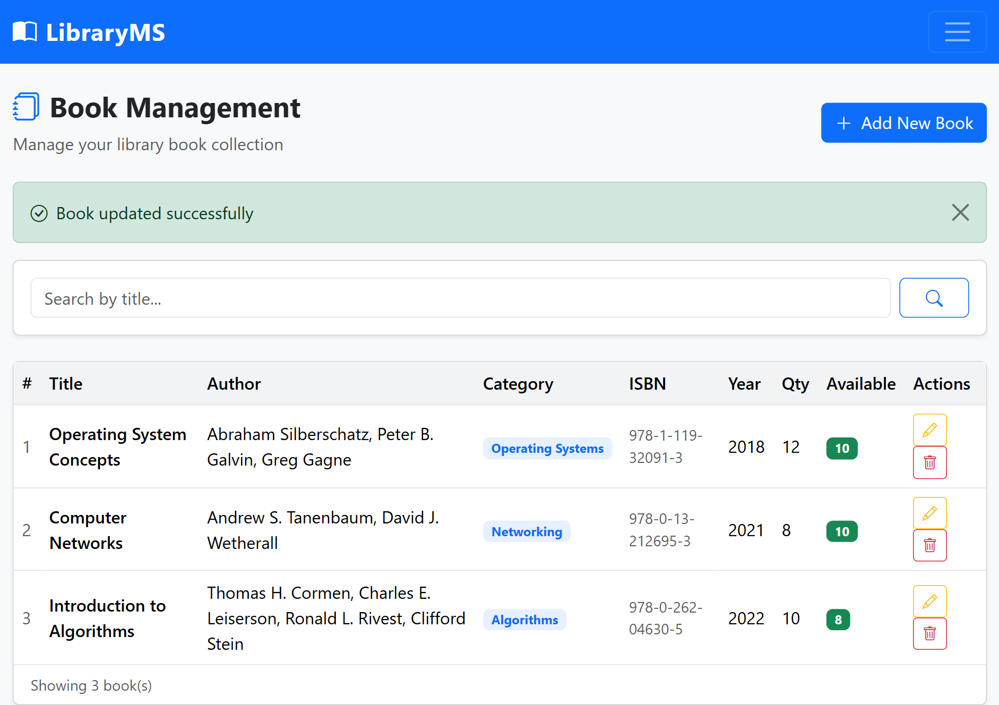

---

### Book Deleted Successfully

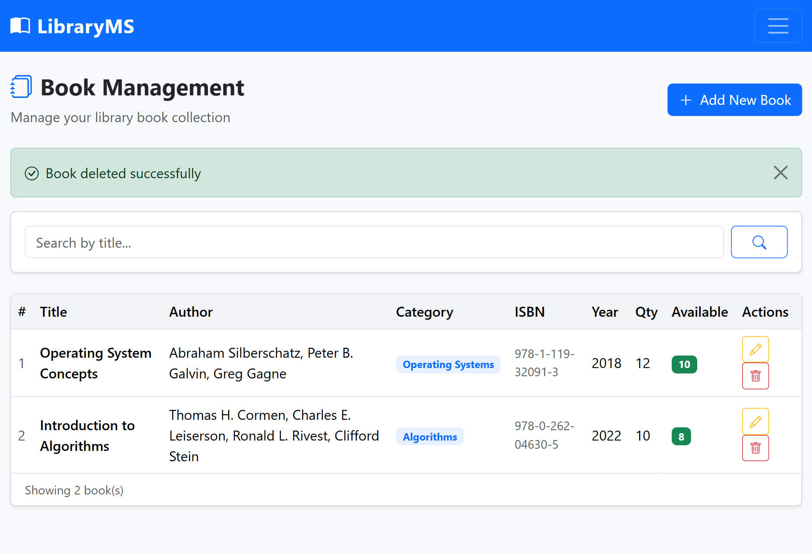

---

### Add Member

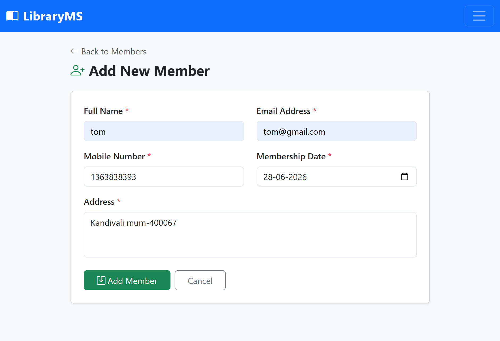

---

### Member Added Successfully


---

### View All Members

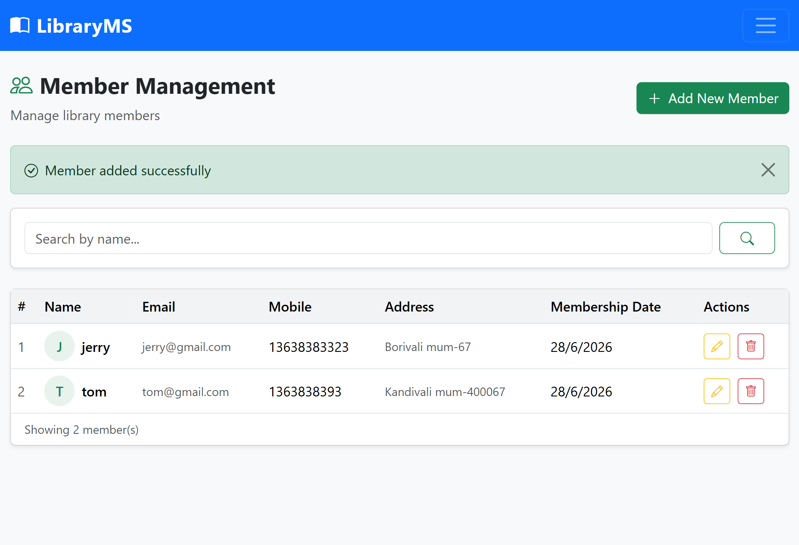

---

### Search Members

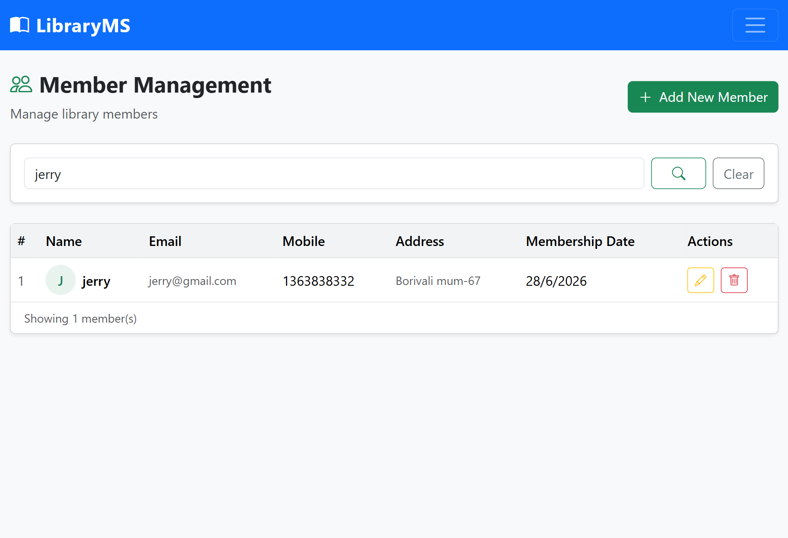

---

### Update Member

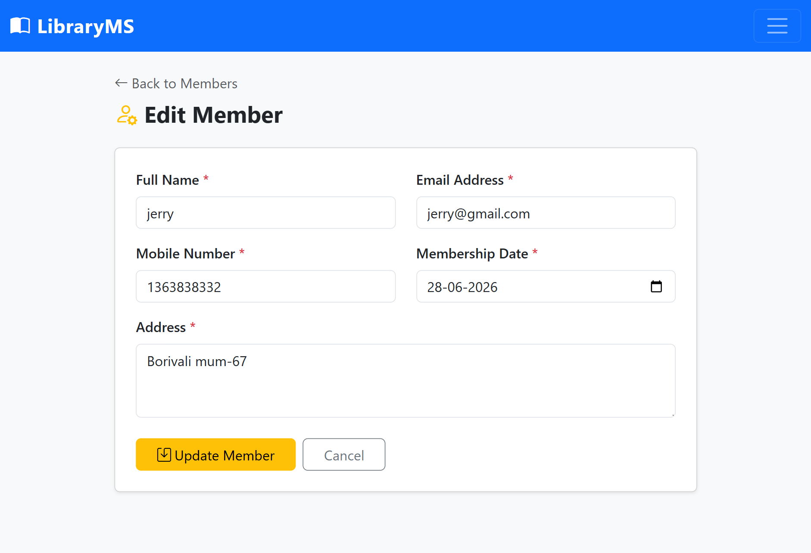

---

### Member Updated Successfully


---

### Member Deleted Successfully

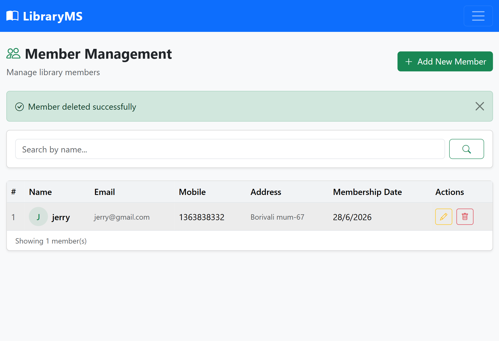

---

## Add Member


---

## Member Added Successfully


---

## View All Members


---

## Search Members


---

## Update Member


---

## Member Updated Successfully


---

## Member Deleted Successfully


---

# 🛠️ Tech Stack

| Technology      | Purpose                       |
| --------------- | ----------------------------- |
| Node.js         | Runtime Environment           |
| Express.js      | Web Framework                 |
| MongoDB         | Database                      |
| Mongoose        | MongoDB ODM                   |
| EJS             | View Engine                   |
| Bootstrap 5     | Responsive UI                 |
| Multer          | Image Upload                  |
| Method-Override | Support PUT & DELETE Requests |
| Nodemon         | Development Server            |

---

# 📁 Folder Structure

```text
library-management/
├── app.js
├── db.js
├── package.json
├── upload/
│   ├── dashboard.png
│   ├── books_add.png
│   ├── Book_added_successfully.png
│   ├── view_all_books.png
│   ├── books_search.png
│   ├── books_update.png
│   ├── Book_updated_successfully.png
│   ├── Book_deleted_successfully.png
│   ├── members_add.png
│   ├── Member_added_successfully.png
│   ├── view_all_member.png
│   ├── members_search.png
│   ├── members_update.png
│   ├── Member_updated_successfully.png
│   └── Member_deleted_successfully.png
├── uploads/
├── public/
├── Controller/
├── Middleware/
├── Model/
├── Routes/
├── Views/
└── README.md
```

---

# ⚙️ Prerequisites

Install the following software before running the project:

* Node.js (v16 or later)
* MongoDB Community Server
* Visual Studio Code

---

# 🚀 Installation

### Clone the repository

```bash
git clone https://github.com/your-username/library-management.git
```

### Move into the project directory

```bash
cd library-management
```

### Install dependencies

```bash
npm install
```

### Start MongoDB

**Windows**

```bash
mongod
```

**Linux / macOS**

```bash
sudo systemctl start mongod
```

### Run the application

```bash
npm run dev
```

Open your browser and visit:

```
http://localhost:4000
```

---

# 📌 Available Routes

## Dashboard

| Method | Route | Description |
| ------ | ----- | ----------- |
| GET    | /     | Dashboard   |

### Books

| Method | Route             | Description    |
| ------ | ----------------- | -------------- |
| GET    | /books            | View all books |
| GET    | /books/add        | Add book form  |
| POST   | /books/add        | Save book      |
| GET    | /books/edit/:id   | Edit book form |
| PUT    | /books/edit/:id   | Update book    |
| DELETE | /books/delete/:id | Delete book    |

### Members

| Method | Route               | Description      |
| ------ | ------------------- | ---------------- |
| GET    | /members            | View all members |
| GET    | /members/add        | Add member form  |
| POST   | /members/add        | Save member      |
| GET    | /members/edit/:id   | Edit member form |
| PUT    | /members/edit/:id   | Update member    |
| DELETE | /members/delete/:id | Delete member    |

---

# 📦 npm Scripts

| Command       | Description           |
| ------------- | --------------------- |
| `npm start`   | Start the application |
| `npm run dev` | Start with Nodemon    |

---

# 🔧 Configuration

MongoDB connection (`db.js`):

```javascript
mongoose.connect("mongodb://localhost:27017/libraryDB");
```

---

# 👨‍💻 Author

Developed as a **Library Management System** project using **Node.js**, **Express.js**, **MongoDB**, **EJS**, **Bootstrap 5**, and **Multer** following the **MVC architecture**.
